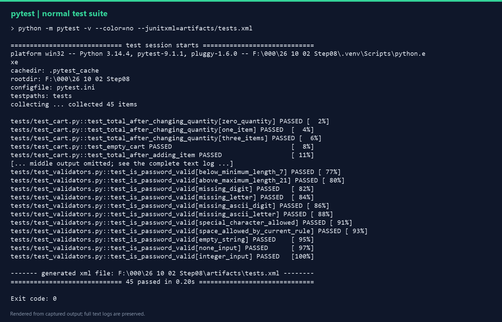
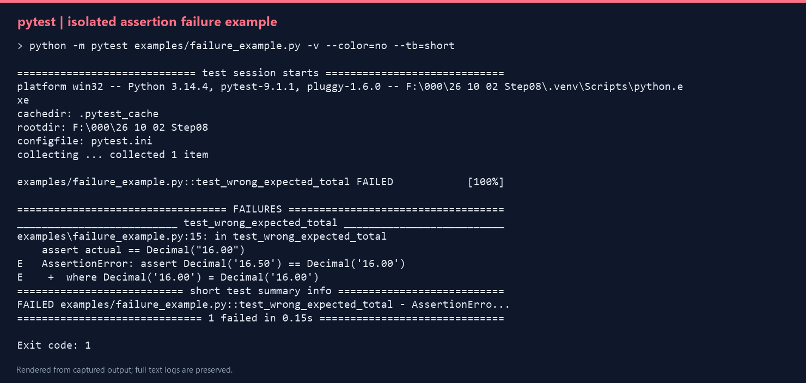

# Python 与 pytest 测试作品

这是一个可运行的 Python 测试项目，包含手机号校验、密码校验和购物车总价计算。使用 pytest 参数化、fixture 和异常断言组织 45 个独立测试场景，并提供真实运行证据和独立副本验证记录。

## 快速运行

在项目根目录打开 PowerShell，使用 Python 3.10 或更高版本：

```powershell
python -m venv .venv
.\.venv\Scripts\python.exe -m pip install -r requirements.txt
.\.venv\Scripts\python.exe -m pytest -q
.\.venv\Scripts\python.exe demo.py
```

无需激活虚拟环境，也无需修改 PowerShell 执行策略。Linux 或 macOS 将 `.\.venv\Scripts\python.exe` 替换为 `.venv/bin/python`。

实际验证环境和测试结果见 [运行摘要](artifacts/summary.json)；独立副本验证见 [复核记录](docs/复核记录.md)。尚未验证所有 Python 版本。

## 功能规则

| 函数 | 规则与返回值 |
| --- | --- |
| `is_phone_number(value)` | 输入必须为以 `1` 开头的 11 位 ASCII 数字字符串，返回布尔值。这是简化练习规则，不校验真实号段，不自动清理空格。 |
| `is_password_valid(value)` | 字符串长度为 8–20，包含英文字母和 ASCII 数字，返回布尔值。允许额外符号与空格，未要求同时包含大写与小写。 |
| `calculate_cart_total(items)` | 商品由 `unit_price` 和 `quantity` 组成。单价为非负有限值，数量为非负整数且不能是布尔值。先求和，再以 `ROUND_HALF_EVEN` 舍入为两位小数的 `Decimal`。 |

空购物车返回 `Decimal("0.00")`。单价缺失、不可转换、负数或非有限值，以及缺失或不合法数量，会抛出 `ValueError` 并指出相关字段。

## 目录结构

```text
.
├── src/qa_utils/             # 被测试函数与统一导入入口
├── tests/                   # 默认测试集与共享 fixture
├── examples/                # 显式运行的失败教学示例
├── tools/                   # 执行验证与绘制日志图的工具
├── artifacts/               # 实际执行产生的报告、日志与图片
├── docs/                    # 测试设计、调试、项目介绍与复核记录
├── demo.py                  # 直接运行的演示
├── pytest.ini               # 测试目录及源码搜索路径
├── requirements.txt         # pytest 依赖
└── .gitignore
```

`pytest.ini` 将测试目录设为 `tests`，源码搜索路径设为 `src`。共享的 `sample_cart` fixture 每次重新创建购物车，避免测试之间相互影响。

## 常用测试命令

```powershell
# 详细执行全部测试
.\.venv\Scripts\python.exe -m pytest -v
# 只执行输入校验
.\.venv\Scripts\python.exe -m pytest tests/test_validators.py -v
# 只执行新增的购物车规则场景
.\.venv\Scripts\python.exe -m pytest tests/test_cart_contract.py -v
# 查看收集到的场景，不执行
.\.venv\Scripts\python.exe -m pytest --collect-only -q
# 生成 JUnit 报告
.\.venv\Scripts\python.exe -m pytest --junitxml=artifacts/tests.xml
```

[测试设计](docs/测试设计.md) 说明 45 个场景的规则与分布；[逐场景执行结果](artifacts/test_cases.csv) 记录实际状态。此项目未统计代码覆盖率。

## 运行证据与失败说明

[完整通过日志](artifacts/pytest-pass.txt)、[JUnit XML](artifacts/tests.xml)、[演示输出](artifacts/demo-output.txt) 都来自实际运行。

下面的图片由真实文本日志绘制为终端输出记录图，方便展示，不是桌面截图；完整内容以对应文本日志为准。



失败示例故意把正确总价 `16.50` 断言为 `16.00`，用于练习定位错误预期。它与正式测试集隔离，默认运行不会收集此示例。

```powershell
.\.venv\Scripts\python.exe -m pytest examples/failure_example.py -v --tb=short
```

这条命令预期得到一条失败和退出码 1。排查步骤见 [调试说明](docs/调试说明.md)。



## 重新生成本地证据

```powershell
.\.venv\Scripts\python.exe tools/verify_project.py
# Windows 下可从实际日志重新绘制记录图
powershell -ExecutionPolicy Bypass -File tools/render_terminal.ps1
```

验证工具执行正常测试、隔离失败示例和演示程序，生成日志、JUnit XML、逐场景 CSV 与摘要。工具自身返回 0 的条件包括正常测试通过、失败示例确实因断言失败、演示成功。

## 项目展示材料

- [成果清单](docs/成果清单.md)
- [学习记录](docs/学习记录.md)
- [项目介绍与面试表达](docs/项目介绍.md)
- [来源与改动说明](docs/来源与改动.md)
- [GitHub 发布操作](docs/GitHub发布说明.md)

远程 GitHub 发布尚未执行。本地成果包含 Git 提交与可分享压缩包，发布后可在此补充实际仓库链接。
